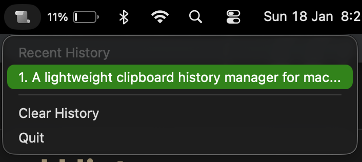

# Cliphis - Clipboard History Manager

  

A lightweight clipboard history manager for macOS that runs in your system tray.

  

## Features

- **Automatic monitoring** - Tracks clipboard changes in real-time
- **System tray integration** - Quick access from the menu bar
- **Smart deduplication** - Automatically removes duplicate entries
- **Persistent storage** - History saved to `~/.clipboard_history/history.json`
- **Quick access** - View and restore up to 25 recent items from the menu
- **Clean interface** - Minimal, unobtrusive design

### Download

Download the latest DMG from the [releases page](https://github.com/7hourspg/cliphis/releases/tag/v1.0.0) and install Cliphis by dragging it to your Applications folder.

## Usage

1. **View history** - Click the system tray icon to see your recent clipboard items
2. **Restore item** - Click any item in the menu to copy it back to your clipboard
3. **Clear history** - Select "Clear History" from the menu
4. **Quit** - Select "Quit" from the menu

## Technical Details

- Built with Go 1.25.5
- Uses [systray](https://github.com/getlantern/systray) for system tray integration
- Monitors clipboard every 100ms
- Stores up to 100 items in history
- Displays up to 25 items in the menu

## Requirements

- macOS
- Go 1.25.5 or later (for building from source)

